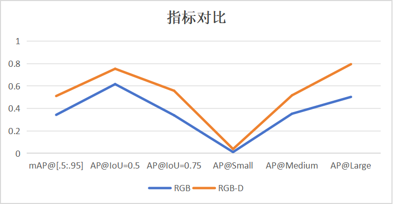
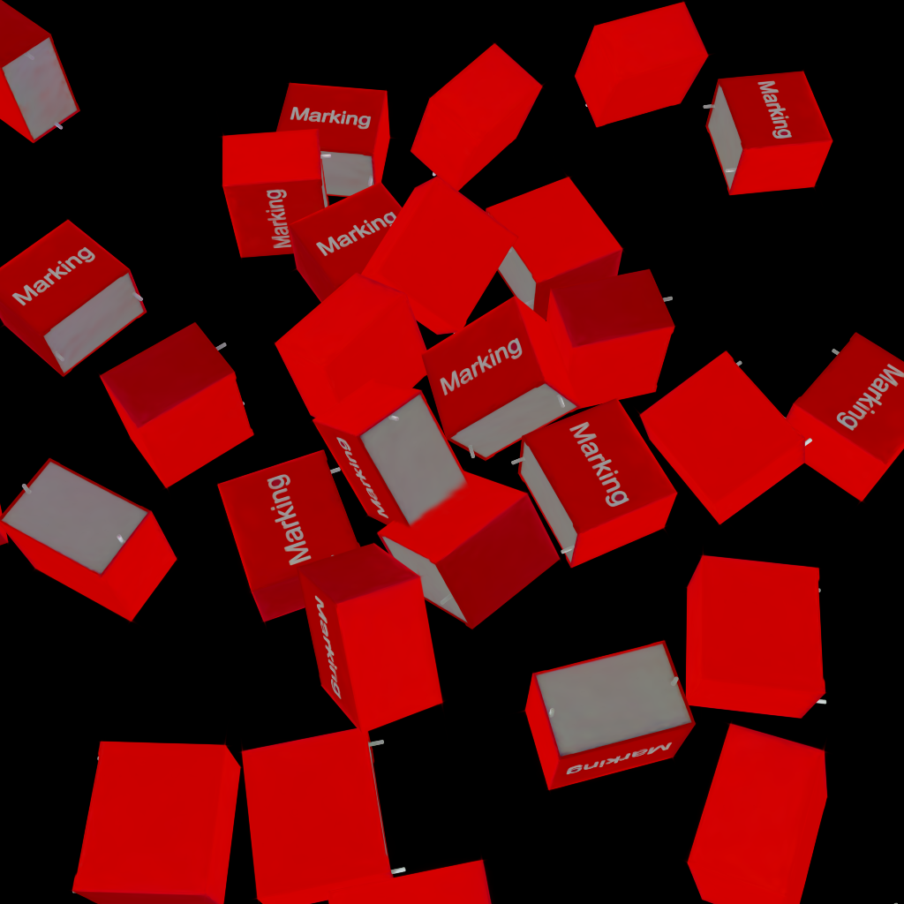
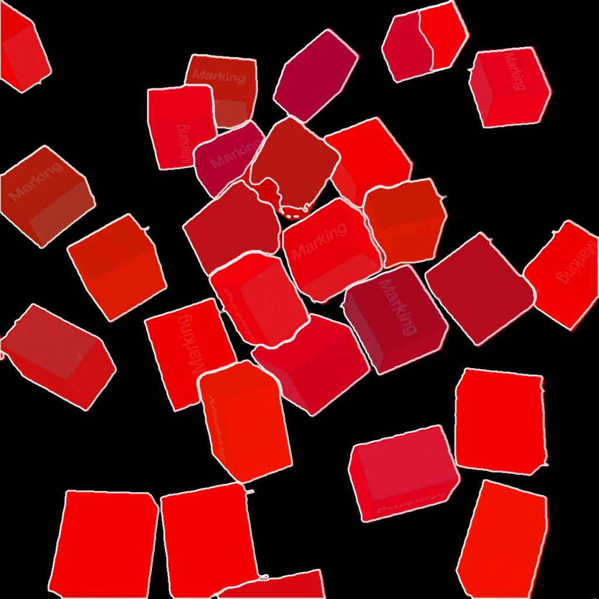

# Purpose
This Project is for Principles and Applications of Artificial Intelligence Fall Cource From BUAA

## Main Mission
Reproduce Mask2Former with given dataset, and add depth pic for training

## Usage
This Project was tested under Python3.10+CUDA12.8+PyTorch2.8.0+MMCV2.2.0 with GeForce RTX 5070
### Install
After [CUDA12.8](https://developer.nvidia.com/cuda-12-8-0-download-archive) installed, follow official doc to install dependencies
   ```CMD
   conda create --name openmmlab python=3.10 -y
   conda activate openmmlab

   pip install torch==2.8.0 torchvision==0.23.0 torchaudio==2.8.0 --index-url https://download.pytorch.org/whl/cu128
   python -c "import torch;print(torch.__version__);print(torch.cuda.is_available())" #test pytorch

   pip install -U openmim
   mim install mmengine
   pip install mmcv==2.2.0 #For Windows users, you may use VS build tool 2019 to build mmcv
   # for more information, visit https://learn.microsoft.com/en-us/visualstudio/releases/2019/history#release-dates-and-build-numbers

   git clone -b main https://github.com/TonyYu02/mmdetection_forAICource.git mmdetection
   cd mmdetection
   pip install -r requirements.txt
   pip install -v -e .
   ```
### Train
```
python tools/train.py configs/mask2former/mask2former_r50_8xb2-lsj-50e_coco-elecd.py
python tools/train.py configs/mask2former/mask2former_r50_8xb2-lsj-50e_elec.py
```
### Demo
```
python demo/image_demo.py demo/test.png configs/mask2former/mask2former_r50_8xb2-lsj-50e_elec.py --weights work_dirs/mask2former_r50_8xb2-lsj-50e_elec/iter_10000.pth --out-dir result --palette "coco"
```
or you can use bat file.
### Result
#### Metric

#### pic to test:

#### result
##### RGB:

##### RGBD:
