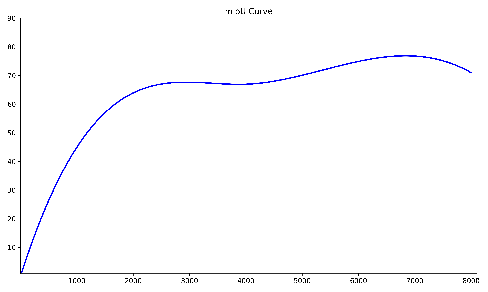
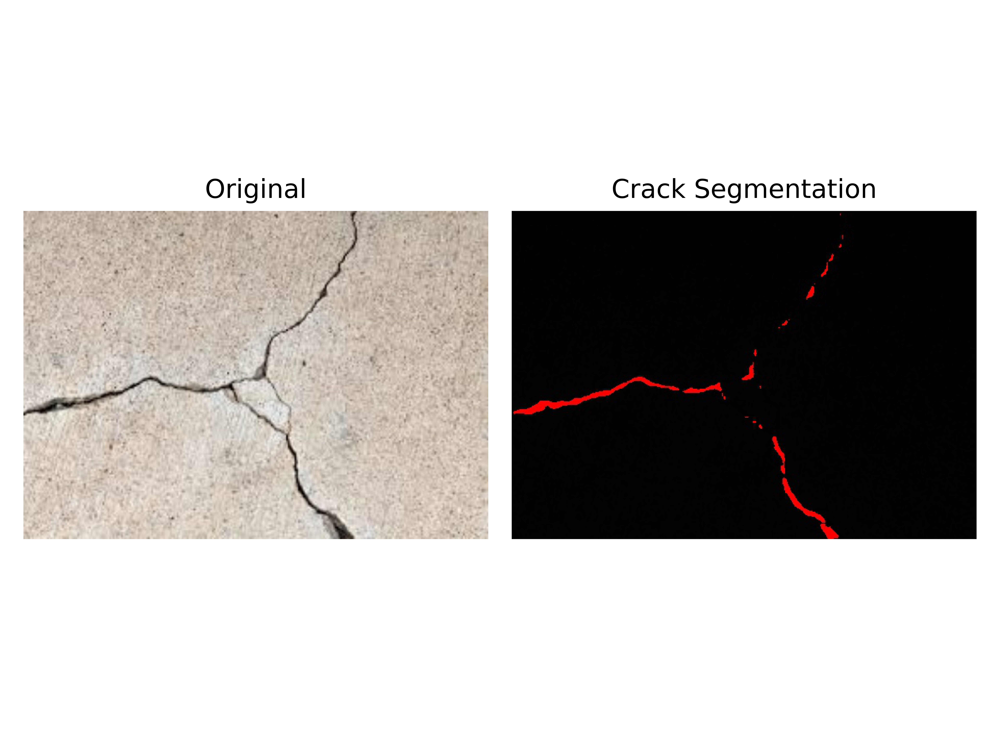
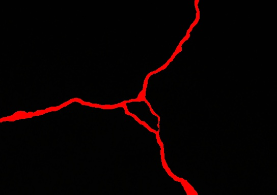
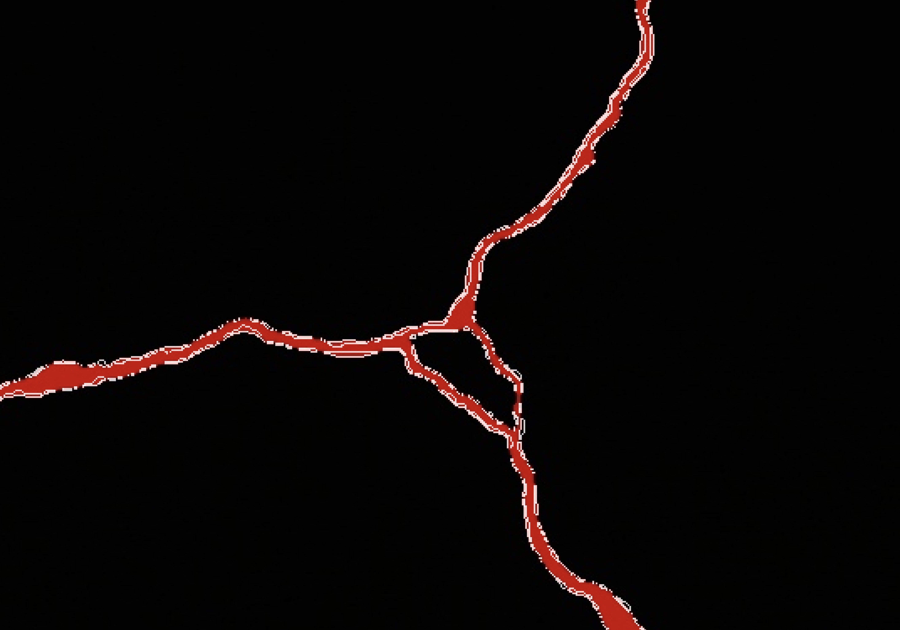
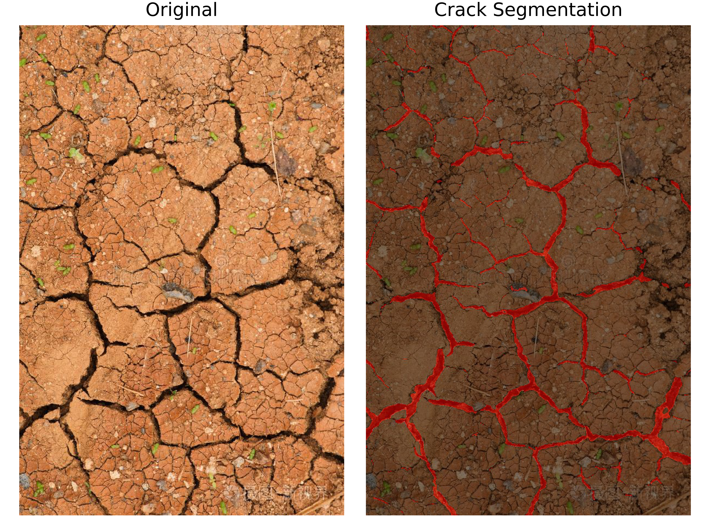

# Purpose
This Project is for Principles and Applications of Artificial Intelligence Fall Cource From BUAA

## Main Mission
Reproduce stdc and Mask2Former with given dataset, and compared the results.

stdc: [paper and source code](https://github.com/MichaelFan01/STDC-Seg)  
Mask2Former: [paper and source code](https://github.com/facebookresearch/Mask2Former)  
Deepcrack Dataset: [data](https://github.com/yhlleo/DeepCrack/blob/master/dataset/DeepCrack.zip)

## Usage
This Project was tested under Python3.9+CUDA11.8+PyTorch2.3.0+MMCV2.2.0+MMDetection3.3.0 with GeForce RTX 1650

### Install
After [CUDA11.8](https://developer.nvidia.com/cuda-11-8-0-download-archive) installed, follow official doc to install dependencies
   ```CMD
   conda create --name open118 python=3.9 -y
   conda activate open118

   conda install pytorch==2.3.0 torchvision==0.18.0 torchaudio==2.3.0 pytorch-cuda=11.8 -c pytorch -c nvidia
   python -c "import torch;print(torch.__version__);print(torch.cuda.is_available())" #test pytorch

   pip install -U openmim
   mim install mmengine
   pip install mmcv==2.2.0 -f https://download.openmmlab.com/mmcv/dist/cu118/torch2.3/index.html
   pip install "mmdet>=3.0.0"
   # we suggest installing mmdetection from https://github.com/TonyYu02/mmdetection_forAICource
   # if you use pip, you should change ~\envs\open118\lib\site-packages\mmdet mmcv_maximum_version = '2.2.1'

   git clone -b main https://github.com/TonyYu02/mmsegmentation_forAICource.git mmsegmentation
   cd mmsegmentation
   pip install -r requirements.txt
   pip install -v -e .
   ```
### Train
Each model shall be trained for 8,000 epochs, since we noticed that model overfit after training for 10,000 epochs.
```
python tools/train.py configs/stdc/stdc1_10k_crack-544x384.py
python tools/train.py configs/mask2former/mask2former_swin-t_8xb2-90k_-crack-544x384.py
```
### Demo
```
python demo/image_demo.py demo/southeast.jpg configs/mask2former/mask2former_swin-t_8xb2-90k_-crack-544x384.py work_dirs/mask2former_swin-t_8xb2-90k_-crack-544x384/iter_8000.pth --out-file result/southeast_m2fsf.jpg
```
or you can use bat file.
### Result
#### for stdc



#### for Mask2Former




We also use a pic from Internet to test:

